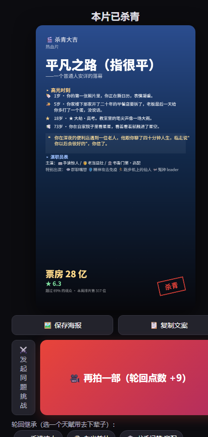
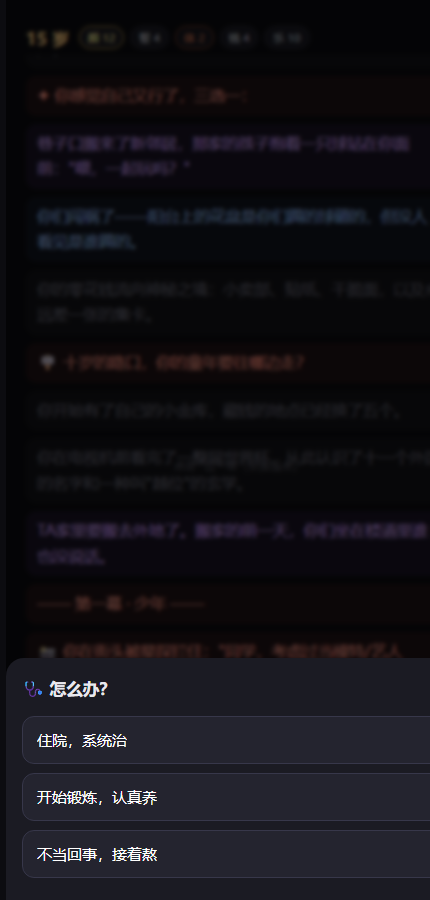

<div align="center">

# 🎬 杀青 · 人生短剧模拟器

**你过的不叫日子，叫片场；你活的不叫人生，叫剧本；死了不叫死，叫杀青。**

*每条命，都是一部戏。游戏打的是这部"人生短剧"的票房——不是你过得好不好，也不是你过得有多惨。*

[](LICENSE)
[](src/engine)
[](#)
[](#)
[](#-游戏数据)
[](#-隐藏轨道)
[](#-快速开始)

**[▶ 立即游玩（GitHub Pages）](https://alakazamc.github.io/shaqing/)**
·
[下载源码双击即玩](../../archive/refs/heads/main.zip)

</div>

---

## 📸 一眼看懂

| 选角 | 拍摄中 |
|---|---|
|  |  |
| **杀青海报** | **片名页** |
|  |  |

## 🎮 30 秒上手

1. **选角** —— 天赋十连抽选 3（负面天赋才有节目效果）
2. **配置** —— 颜/智/体/钱/乐 五维分 20 点（有一键梗模板：牛马模板 / 躺平大师 / 赌狗必输）
3. **开拍** —— 点击过人生：机缘金闪、危机抉择、十年路牌、特质三选一、称号收集
4. **大劫** —— 高考是 5 秒手速 QTE，求职/相亲/裁员/病床是算分演出，你的全部积累逐项拍入
5. **杀青** —— 生成电影海报：片名 + 类型 + 票房构成 + 经典台词 + 演职员表，一键保存/复制
6. **轮回** —— 票房换轮回点数；继承 1 个天赋；收集死法图鉴；集齐 5 条轨道结局解锁 **杀青宴**

全程纯点击 · 无教程 · 单局 2-4 分钟 · 默认静音（摸鱼友好）

## ✨ 它有什么

**🎭 多线剧本系统** —— 9 条跨越数年的连续故事：高考全本（分科→一模→QTE→出分→复读抉择→多年后的考场回声）、初恋全本、发小、父母、职场、走红、婚姻、病榻、执念。选择会在多年后被具体点名。

**🎬 电影化包装** —— 死亡=杀青，结算=海报。片名生成器（`《37秒女帝》`/`《修仙从戒网瘾开始》`）、票房公式（基础盘 × 振幅 × 贯彻）、豆瓣式开分、假排片位（"本周排片第 4897 位，排在汪汪队之后"）。

**🀄 圈层梗分层** —— L1 沉淀 / L2 圈层 / L3 冒险三层词库；弹幕池按圈层注入（电竞/修仙/谷子/怪谈/说唱…）；导演会在片名页阴阳怪气（死亡 50 次时："外卖在楼下，先吃饭吧"）。

**⚔️ 同题挑战** —— 海报页一键生成挑战链接（含 seed + 你的战绩），朋友打开就是"同一个剧组"，结算页自动对比票房。纯静态实现，无需后端。

**🔒 内容红线** —— od/地雷/自伤线全部含蓄化处理且出口必在（校验器强制）；人物不是笑点，靶子永远是环境。

## 🌓 隐藏轨道

> 10 条亚文化暗线，入口以"机缘"形态出现，触发条件玩家不可见——攻略由社区挖掘

`☯️ 修仙` · `🕹️ 电竞` · `💰 富豪` · `🏚️ 鹤岗` · `🎤 偶像` · `🏨 规则怪谈` · `🎙️ 说唱` · `🎫 谷子` · `🪄 魔法` · `🤖 AI赛博`

每条 5 级深度、独占结局称号。达成 5 条结局 → 解锁真结局 **🥂 杀青宴**。

## 🚀 快速开始

```bash
# 方式一：什么都不装
双击 index.html

# 方式二：本地服务（可选）
python -m http.server 8080
```

测试（Node ≥ 18，零依赖）：

```bash
node test/validate.mjs        # 内容校验：schema/唯一性/红线词/年龄覆盖/旗标完整性
node test/simulate.mjs 800    # 无头模拟：随机玩 800 局输出平衡指标
node test/arcstats.mjs 500    # 剧本触发率：各条多线剧本的入口/分岔/结局到达率
```

## 📊 游戏数据

| 类别 | 数量 | 类别 | 数量 |
|---|---|---|---|
| 事件 | **1334** | 多线剧本 | 9 条（74+ 链式节拍） |
| 死法图鉴 | 102 | 分支抉择 | 60+ |
| 天赋 | 51 | 特质 | 26 |
| 隐秘轨道 | 10 | 大劫 | 5（三幕化） |
| 称号 | 18 | 成就 | 15 |
| 弹幕池 | 20 | 导演寄语 | 8 |

模拟平衡基线（800 局零失败）：评分均值 6.2 / 最高 9.9 · 票房均值 ~42 亿 · 决策 30 次/局 · 41% 的局走完剧本深处

## 🏗️ 架构

```
index.html            入口（无构建，全局脚本直载）
src/engine/engine.js  状态机+剧本队列+打分+片名生成（无 DOM，Node 可直跑）
src/ui/               界面控制器 / 海报 Canvas / WebAudio 合成音效
content/              全部内容数据（事件/剧本/天赋/死法/危机/轨道/梗）
test/                 无头测试（loader/simulate/validate/arcstats）
docs/                 设计文档 + 本 README 的截图
```

设计文档：[正典](docs/design/00-canonical.md) · [传播公式](docs/research/02-viral-formula.md) · [玩法循环](docs/design/10-gameplay-core.md) · [剧本系统](docs/design/20-arcs.md) · [节奏模型](docs/design/21-rhythm.md) · [内容红线](docs/research/03-subculture.md)

## 🤝 贡献

欢迎按 [UGC 扩池规范](docs/ugc.md) 提 PR 加事件——schema、语感基准、红线扫描、平衡基线都写好了。原作验证过：**社区写的梗，比官方写的更好笑**。

## 🙏 致谢

- [人生重开模拟器](https://github.com/VickScarlet/lifeRestart) —— 本作的直系精神祖先（修仙彩蛋教会我们：隐藏内容是留存引擎）
- 《小丑牌》Balatro —— 算分演出的数字奇观
- 《吸血鬼幸存者》—— 三选一微决策的节奏
- 《王权》Reigns —— 决策张力与状态机叙事
- 短剧工业 —— 黄金三秒与反转节拍表

## 📄 License

[MIT](LICENSE) —— 随便玩，随便改，别拿去加广告（正典宪法 C2）。

<div align="center">

**杀青大吉** 🎬

*下辈子记得抽我*

</div>
